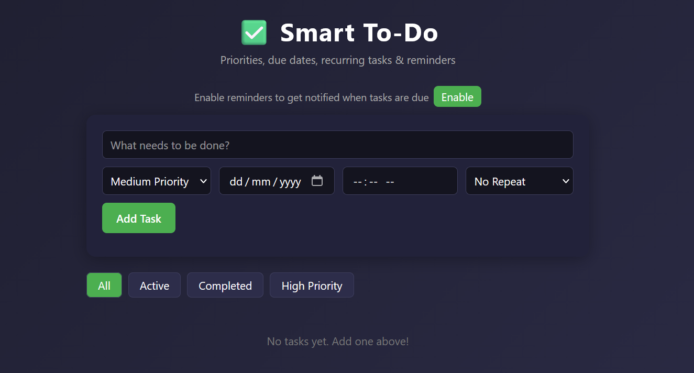

# Smart To-Do with Reminders

A lightweight, no-database to-do list app built with plain HTML, CSS, and JavaScript. All data is stored locally in the browser using `localStorage` — no backend or internet connection required.

## Features

- **Add tasks** with a title, priority level, due date, due time, and repeat option
- **Priority levels** — High, Medium, Low — shown with color-coded borders
- **Due date & time** — overdue tasks are automatically flagged
- **Recurring tasks** — Daily or Weekly tasks automatically regenerate the next occurrence when marked complete
- **Browser notifications** — get notified when a task's due time arrives (requires notification permission)
- **Drag-and-drop reordering** — rearrange tasks in any order
- **Filters** — view All, Active, Completed, or High Priority tasks
- **Persistent storage** — tasks are saved in `localStorage` and remain after closing/reopening the browser

## How to Run

1. Download `smart_todo.html`
2. Open it directly in any modern browser (Chrome, Edge, Firefox)
3. No installation, server, or build step required

## How to Use

1. Type a task in the input box
2. Select a priority, optionally set a due date/time and a repeat frequency
3. Click **Add Task** (or press Enter)
4. Check the box to mark a task complete
5. Drag tasks to reorder them
6. Use the filter buttons to view specific task groups
7. Click **Enable** near the top to turn on due-time browser notifications

## Tech Stack

- HTML5
- CSS3 (no frameworks)
- Vanilla JavaScript (no libraries)
- Browser `localStorage` API for persistence
- Browser `Notification` API for reminders

Screenshots


## File Structure

```
smart_todo.html   # Single-file app (HTML + CSS + JS)
README.md         # This file
image.png         
```

## Notes

- Notifications only fire while the browser tab is open and the page is loaded (there's no service worker/background sync).
- Since there's no database or server, all data is local to the browser/device it was created on — it won't sync across devices.
